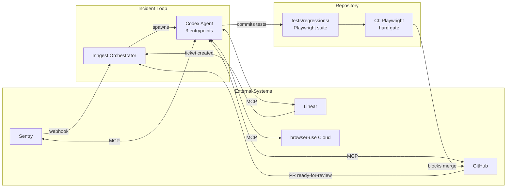
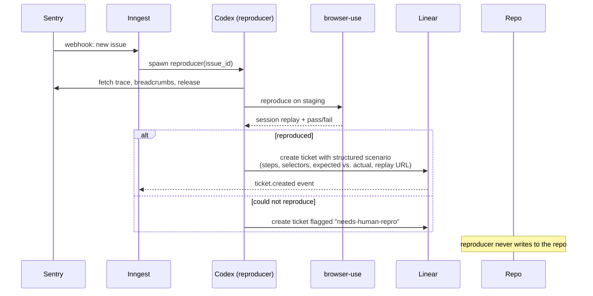
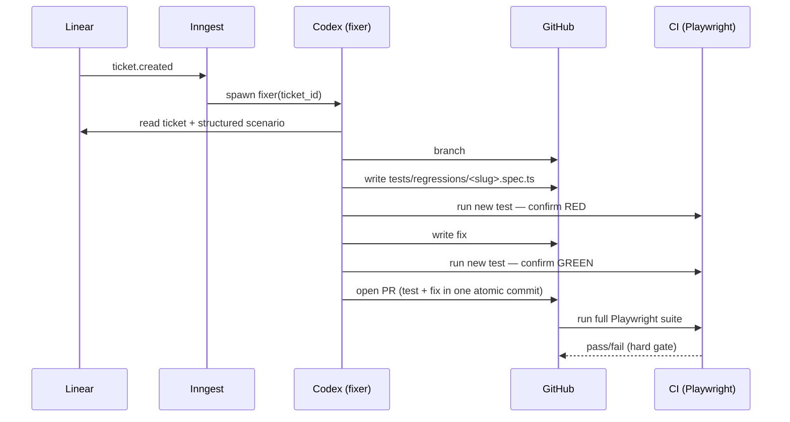
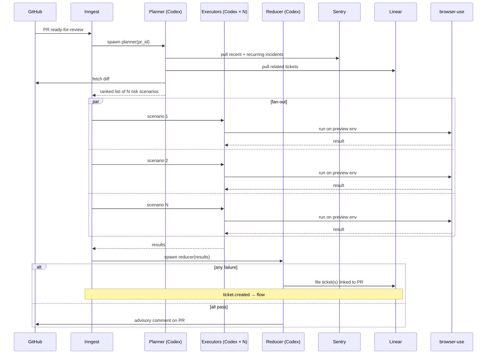
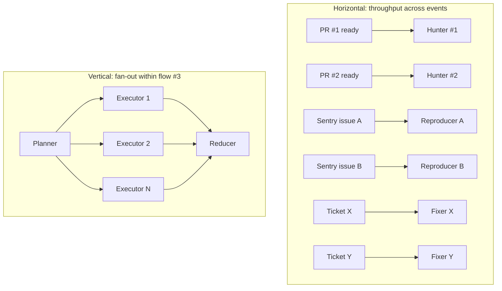

# Incident Loop — Design

**Date:** 2026-04-15
**Status:** Draft (brainstorming output, pre-plan)

## Summary

A closed loop that turns production incidents into deterministic regression tests and targeted pre-merge exploration. One Codex agent with three entrypoints, orchestrated by Inngest, talking to Sentry / Linear / GitHub / browser-use via MCP. The repo's `tests/regressions/` directory is the knowledge base — there is no sidecar database.

The pipeline follows red-green TDD across agents: the **reproducer** proves a bug exists and captures a structured scenario into a Linear ticket, then the **fixer** writes the failing Playwright test and the fix together in one atomic PR. Only the fixer ever writes to `tests/regressions/`, so the suite has a single author and main branch never contains a knowingly-broken or skipped test.

## Goals

- Reproduce every Sentry incident once, then never again (Playwright test committed by the fixer alongside the fix).
- Catch regressions of *known* bugs deterministically in CI.
- Catch *novel* edge cases on PRs, focused by incident history rather than random exploration.
- Minimize moving parts: one agent, one orchestrator, no database.

## Non-goals

- Random monkey-testing unrelated to incident history.
- Replacing human code review — flow #3 is advisory, not a hard gate.
- Running browser-use in the per-PR CI hot path.

## Architecture

**Moving parts**

| Component | Count | Role |
|---|---|---|
| Codex agent | 1 (three entrypoints) | Reasoning + tool use |
| Inngest | 1 | Triggers, fan-out, concurrency keys, retries |
| MCP servers | 4 | Sentry, Linear, GitHub, browser-use |
| CI job | 1 | Playwright regression suite — the only hard gate |
| Databases | 0 | `tests/regressions/` is the KB |

## Flow 1 — Incident Reproducer

**Trigger:** Sentry webhook (new issue or regression).

**Outputs:** one Linear ticket with a **structured scenario** (not code) — reproduction steps, selectors/URLs, expected vs. actual behavior, session replay link, Sentry issue ID. Nothing committed to the repo.
**Handoff:** the `ticket.created` event triggers flow #2, which will write the Playwright test as part of the fix PR.

## Flow 2 — Fix Agent

**Trigger:** Linear ticket created by flow #1 or flow #3.

**Concurrency rule:** Inngest serializes fixers by touched-module key to avoid merge conflicts when two tickets hit the same area. Different modules run in parallel.

**Authoring rule:** the fixer is the *only* agent that writes to `tests/regressions/`. This keeps the suite single-authored and guarantees every committed test was born red-then-green in the same PR as its fix.

## Flow 3 — Incident-Aware Regression Hunter

**Trigger:** PR marked "ready for review" (GitHub webhook).

This flow is the most interesting: it uses past incident data as a **prior** to decide what to explore in the PR's preview environment. It is also the only flow with internal fan-out.

**Key behaviors**

- **Planner** correlates incident history with the diff to rank scenarios by "this area has broken before *and* this PR touches it."
- **Fan-out** runs executors in parallel, bounded by Inngest concurrency keys per preview env.
- **Reducer** is the only step that writes back — keeps side effects in one place.
- **Speculative tests that pass are not committed.** Only validated repros coming back through flow #1 land in `tests/regressions/`, so the suite stays clean.
- **Flow #3 is advisory, not a hard gate.** The hard gate is CI running the existing Playwright regression suite.

## Parallelism Model

Two axes. Inngest handles both.

**Concurrency keys (Inngest)**

| Flow | Key | Why |
|---|---|---|
| Flow 2 (Fixer) | `touched_module` | Prevent merge conflicts between fixers editing the same area |
| Flow 3 (Hunter) | `preview_env_id` | Prevent executors from stepping on each other's test state |
| Flow 3 executors | global rate limit on browser-use | Respect browser-use cloud quota |

**Where parallelism does *not* apply**

- Reproduction inside flow #1 (inherently serial).
- Fix-writing inside flow #2 (one coherent reasoning task).
- A single browser-use session (opaque, can't be split).

## Data Model

No database. Source of truth per concept:

| Concept | Lives in |
|---|---|
| Known bugs (regression tests) | `tests/regressions/*.spec.ts` in the repo — written only by the fixer |
| Reproduction scenarios (pre-fix) | Linear ticket body (structured: steps, selectors, expected/actual, replay URL) |
| Open work | Linear tickets |
| Raw incident signal | Sentry |
| Reproduction evidence | browser-use session replay URLs (linked from Linear) |
| Workflow state | Inngest (durable step functions) |

## Failure Modes & Mitigations

| Failure | Mitigation |
|---|---|
| Flow #1 can't reproduce a Sentry issue | File ticket with `needs-human-repro` label; don't block the loop |
| Two flow #2 fixers conflict on the same module | Inngest concurrency key `touched_module` serializes them |
| Flow #3 executors share a preview env and interfere | Concurrency key `preview_env_id`; or spin up ephemeral envs per PR |
| browser-use cloud rate limit hit | Global concurrency cap in Inngest + backoff |
| Flow #3 floods Linear with false-positive tickets | Reducer dedupes against existing open tickets before filing |
| Regression suite grows unbounded | Only fixer-authored tests land in the suite; flow #3 speculative tests are ephemeral |
| Bug reproduced but never fixed → no regression test exists | Acceptable by design (don't run tests for bugs you won't fix), but add a staleness alert on `bug`-labeled tickets older than N days so the backlog is visible |
| Fixer writes a test that passes before the fix (false red) | Fixer must record the red run's output in the PR description; reviewers check that the test genuinely failed pre-fix |

## Decisions

These were open during brainstorming and are now fixed for v1. Revisit after ~4 weeks of production data.

### D1. Preview environments → per-PR preview URLs from the host platform
Flow #3 targets the PR's own preview environment (Vercel/Render/Fly-style, whatever the host provides natively). Concurrency key `preview_env_id` maps to the PR number, so executors within one PR share an env but different PRs run fully in parallel.

**Fallback:** if the host doesn't support per-PR previews, degrade to a shared `staging` env with `preview_env_id = "staging"`, which serializes flow #3 globally. Acceptable for <5 PRs/day.

**Not doing:** Inngest-provisioned ephemeral envs. Too much infra for v1.

### D2. Fixer PRs → drafts, human promotes to ready-for-review
Flow #2 opens **draft** PRs. A human skims (test + fix + red/green evidence in the PR body) and clicks "ready for review," which then triggers flow #3 against the fix PR itself. This gives a recursive safety property: every fixer PR gets hunted by the same incident-aware regression hunter as a human PR, catching fixes that introduce new regressions.

**Revisit:** after ~50 fixer PRs, if zero have been rejected during promotion, relax to normal (non-draft) PRs.

### D3. Scenario budget → fixed N = 5 executors per flow #3 run
The planner ranks scenarios; the reducer runs the top 5. Predictable cost, easy to reason about.

**Config knobs exposed from day one:**
- `MAX_SCENARIOS_PER_PR` (default 5)
- `BROWSER_USE_GLOBAL_CONCURRENCY` (global cap across all flows)

**Revisit:** when data shows which scenario ranks actually catch bugs — then upgrade to risk-weighted N.

### D4. Reducer dedup → 30-day window, error-signature match, comment-on-match
Before filing a Linear ticket, the reducer searches Linear for tickets matching on **error signature hash** = `sha256(route + error_class + top_stack_frame)`, looking at **open tickets created in the last 30 days**.

- **Match found:** post a comment on the existing ticket (`flow #3 hit this again on PR #123, session replay: ...`). No new ticket.
- **No match:** file a new ticket with the signature hash stored as a field for future dedup.

**Revisit:** if Linear fills with duplicates in week 1, tighten. If real regressions are buried as comments on stale tickets, loosen.

## Out of Scope (for v1)

- Observability dashboards beyond what Inngest + Linear provide out of the box.
- Auto-merging flow #2 PRs — humans review the fix PR before merge.
- Cross-repo incident correlation.
- Historical backfill of existing Sentry issues into `tests/regressions/`.
