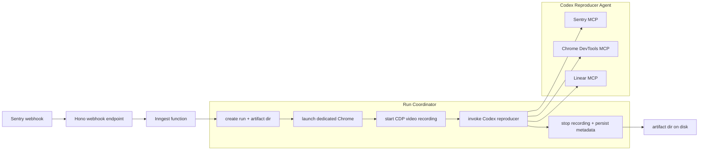
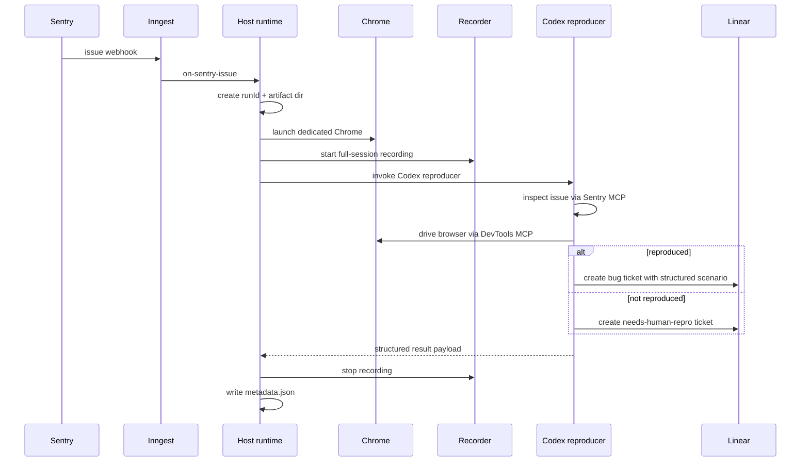

# Incident Loop Localhost Demo Design

**Date:** 2026-04-16
**Status:** Draft for review
**Supersedes for P1:** `docs/superpowers/specs/2026-04-15-incident-loop-design.md`

## Summary

This design revises the incident-loop demo to optimize for a reliable localhost showcase instead of browser-use cloud execution. Phase 1 remains a Sentry-driven reproducer flow, but the browser automation path changes to **Codex SDK + Codex agent + Chrome DevTools MCP** against an app that is already running on localhost.

The product goal for this revision is simple: when a Sentry issue webhook arrives, the system should launch a dedicated browser session, record the full browser interaction, let a Codex reproducer agent investigate and attempt the repro, create a Linear ticket with a structured scenario, and save a browser video artifact to disk for the demo.

## Goals

- Keep Codex central to the reproducer flow.
- Replace browser-use with Chrome DevTools MCP for browser control.
- Run entirely on localhost for the demo path.
- Save a full-session browser video to disk for every repro run.
- Keep orchestration logic small and deterministic in Node.

## Non-goals

- Browser-use cloud integration.
- Production-grade artifact hosting or replay serving.
- Building a separate frontend UI for reviewing runs in v1.
- Having the host process author Linear tickets or repro steps.

## Revised Architecture



## Ownership Boundaries

### Node / host runtime owns

- Receiving and validating the Sentry webhook.
- Creating a run id and artifact directory.
- Launching a dedicated Chrome instance for the run.
- Starting and stopping browser video recording.
- Invoking the Codex reproducer agent through the SDK path.
- Persisting run metadata and local artifact paths.

### Codex reproducer agent owns

- Inspecting the Sentry issue through MCP.
- Navigating and interacting with the localhost app through Chrome DevTools MCP.
- Determining whether the issue was reproduced.
- Writing the structured scenario.
- Creating the Linear ticket through MCP.
- Returning a structured result payload to the host runtime.

This boundary is deliberate: the host process manages lifecycle and artifacts; Codex performs the actual investigation.

## Phase 1 Flow



## Browser Model

The target app is assumed to be **already running on localhost**. Incident-loop does not start the app. The host runtime receives a configured `TARGET_APP_URL`, for example `http://localhost:3001`.

For each run, the system launches a **dedicated Chrome instance** with:

- an isolated user-data-dir
- a known remote-debugging port
- a single purpose: serve the repro run

This is preferable to relying on loose browser auto-discovery because both:

- the Codex reproducer via Chrome DevTools MCP, and
- the browser video recorder via the Chrome DevTools Protocol

must attach to the same browser instance deterministically.

## Codex Runtime Strategy

The intended runtime shape is:

- server-side OpenAI Agents SDK orchestration
- Codex invoked through the Codex SDK path
- Chrome DevTools MCP provided as a tool surface to the Codex reproducer

The host runtime should treat Codex as the single reproducer agent rather than spreading repro business logic between Node and prompts. Node should pass:

- Sentry issue basics
- run id
- artifact directory
- target app url
- browser connection context

and Codex should do the rest.

## Prompt Contract

The reproducer prompt must be revised to remove browser-use and explicitly require:

- use Sentry MCP to inspect the incident
- use Chrome DevTools MCP to drive the localhost browser
- do not commit code or create PRs
- create exactly one Linear ticket
- return a structured result payload

The prompt should require evidence collection in terms appropriate to DevTools-based reproduction:

- exact reproduction steps
- expected behavior
- actual behavior
- final URL
- important console errors
- important failed network requests
- saved browser video path

## Result Contract

Codex should return a structured result that the host can parse without brittle text scraping. A representative shape:

```json
{
  "status": "reproduced",
  "reproduced": true,
  "ticketUrl": "https://linear.app/example/issue/ENG-123/example",
  "summary": "Checkout coupon retry throws TypeError after invalid coupon path",
  "finalUrl": "http://localhost:3001/checkout",
  "steps": [
    "Open /checkout",
    "Apply an invalid coupon",
    "Retry with a valid coupon"
  ],
  "expected": "Coupon state recovers and totals update",
  "actual": "A TypeError is thrown and totals stop updating",
  "evidence": {
    "videoPath": ".incident-loop-artifacts/runs/<runId>/browser.mp4",
    "consoleErrors": 2,
    "failedRequests": 1
  }
}
```

The host runtime may normalize or supplement this payload in metadata, but it should not invent or rewrite the actual scenario.

## Artifact Layout

Each run gets a stable directory on disk:

```text
.incident-loop-artifacts/
  runs/
    <runId>/
      browser.mp4
      metadata.json
      console.json
      network.json
```

### Required artifacts

- `browser.mp4`: full browser session from first navigation through completion.
- `metadata.json`: host-level run metadata and final outcome.

### Optional artifacts

- `console.json`: extracted console messages if captured.
- `network.json`: extracted failed requests or notable network traces if captured.

For the demo, saving to disk is enough. No artifact UI is required.

## Failure Handling

The run lifecycle must preserve artifacts whenever possible:

1. create run
2. launch Chrome
3. start recording
4. invoke Codex
5. stop recording in `finally`
6. write metadata

### Failure rules

- If Chrome launch fails: fail the run immediately.
- If video recording fails: continue the run, but record `video_status: failed`.
- If Codex times out or errors: still stop recording and persist metadata.
- If Codex reproduces but Linear ticket creation fails: return a distinct status such as `reproduced_but_ticket_failed`.
- If the bug is not reproduced: Codex should still create a `needs-human-repro` ticket.

This keeps the demo legible even when the run is unsuccessful.

## Configuration

### Add

- `OPENAI_API_KEY`
- `TARGET_APP_URL`
- `SENTRY_WEBHOOK_SECRET`
- `LINEAR_API_KEY`
- `ARTIFACTS_DIR` optional
- `CHROME_PATH` optional
- `FFMPEG_BIN` optional

### Remove from the localhost demo path

- `CODEX_BIN`
- `BROWSER_USE_API_KEY`

### Chrome DevTools MCP configuration

The browser tool path should use Chrome DevTools MCP. Conceptually the desired server shape is:

```toml
[mcp_servers.chrome-devtools]
command = "npx"
args = ["chrome-devtools-mcp@latest"]
```

For the actual demo implementation, the runtime should attach DevTools MCP to the dedicated browser instance rather than depending on ambient browser auto-connection.

## Components

### `src/runs/createRun.ts`

Creates run ids, directories, and metadata scaffolding.

### `src/browser/session.ts`

Launches and tears down the dedicated Chrome process.

### `src/browser/record.ts`

Handles CDP-based full-session browser recording and writes `browser.mp4`.

### `src/codex/reproducer.ts`

Owns invoking the Codex reproducer agent and returning structured results.

### `src/prompts/reproducer.ts`

Builds the reproducer instructions around localhost, DevTools MCP, and the structured result contract.

### `src/inngest/functions/onSentryIssue.ts`

Coordinates the run lifecycle but does not perform repro reasoning or ticket authoring itself.

## Testing Strategy

### Unit tests

- env parsing for new localhost-demo variables
- run directory creation
- browser launch argument generation
- recording lifecycle
- prompt content includes localhost + DevTools MCP + no repo writes + ticket creation responsibility

### Integration tests with mocks

- webhook emits event and triggers run coordinator
- success path creates artifact dir and writes metadata
- failure path still stops recording and writes metadata
- Codex result parsing is stable and structured

### Manual verification

1. start target app locally
2. start Inngest dev and the incident-loop server
3. post a fake Sentry webhook
4. verify a run directory exists
5. verify `browser.mp4` is saved
6. verify a Linear ticket is created

## Plan Impact

This design requires a corresponding plan rewrite in at least these areas:

- P0 foundation currently assumes subprocess `codex exec`; replace with SDK-based Codex agent runtime.
- P1 environment schema currently includes browser-use credentials; replace with localhost-demo and recording config.
- P1 prompt builder must change from browser-use replay semantics to DevTools evidence semantics.
- P1 done criteria must include `browser.mp4` artifact verification.

Flow 3 still references browser-use in the original design. That can stay out of scope for the first localhost demo, but it should not be treated as already aligned with this design.

## Open Questions Resolved

- Target app startup: out of scope; app is already running on localhost.
- Browser control: Chrome DevTools MCP.
- Browser video: auto-save on every run.
- Video scope: full session.
- Artifact destination: save to disk; no UI required.
- Linear ownership: Codex creates the ticket, not the host runtime.
